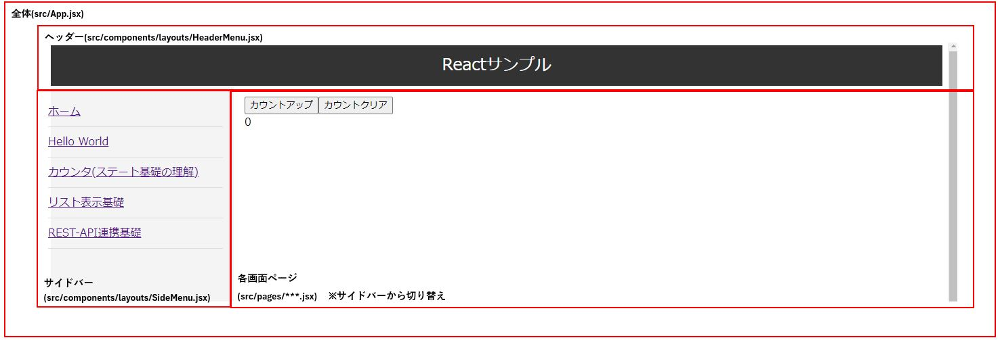

# React サンプルソースのプロジェクト

## 概要
このプロジェクトは、Reactの簡易サンプル例をいくつか記載して、理解の助けにしているものとなります。

## 必要なソフト(入れていないもののみ)
* VSCode(最新版)  
  https://code.visualstudio.com/download

* Node.js(LTS版)  
  https://nodejs.org/en/download/package-manager  

* React Extension Pack(VSCodeの拡張機能)  
  VSCodeから、左メニューの拡張機能のアイコンを選択して拡張機能インストールのメニューを開く。  
  拡張機能インストールのメニューから、"react"と検索し、表示された"React Extention Pack"をインストールする。  

## 動作環境準備
Reactの開発サーバを立ち上げるための事前準備となります。

1. コマンドプロンプトで、このプロジェクトのルートディレクトリに入る  
   (以後はこのルートディレクトリ上での作業を前提とする)

2. 以下のコマンドを実行
```bash
# Reactなどのライブラリのモジュールをインストール(少し時間がかかるかも)
# ※成功すると、ルートディレクトリ上に[node_modules]フォルダができ、中にたくさんのJavaScriptモジュール関連フォルダが出来上がる(詳細はみなくていい)
npm install
```

## React開発サーバ起動
開発Webサーバを起動して、ブラウザからReactアプリケーションを起動する手順となります。

1. package.jsonを開く  
   VSCode上で、ルートディレクトリにあるpackage.jsonを開く

2. 開発サーバを起動
   VSCodeから開いたpackage.jsonのscriptsタグの上に">デバッグ"と表示がされる。
   これを選択すると、VSCodeの中央上に、"dev","build","lint","preview"の4つの選択肢(scriptsタグに書かれたもの)が表示される。
   ここから"dev"を選択すると、開発Webサーバが起動する。

3. ブラウザで開発サーバ(http://localhost:5000)を開く

## ソース構成


ブラウザでアプリを起動すると、以下の順に動く  
main.jsx → App.jsx → 各画面のパーツ(コンポーネント)を配置

※各画面はsrc/pagesにあるので、基本的にはこの中のソースを編集していく。  
※共通部修正する場合は、ヘッダーやサイドバーも編集あり

## ソース編集について
Reactのソースは、修正すると自動的に画面に反映されます。  
そのためソース修正の度に開発サーバの再起動は不要です。

## (補足)
1. Reactプロジェクトは、ViteというJavaScriptのビルドツールを用いて作成しています。