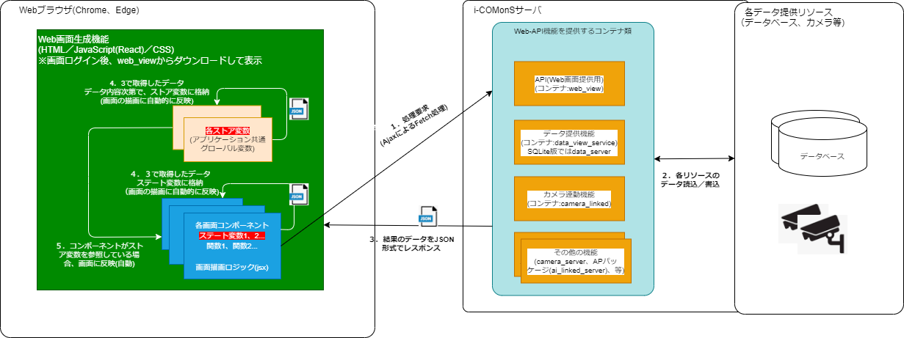

## i-COMonS 画面(フロントエンド)側 コーディング導入説明(React レクチャー)

---

## React とは

- Meta(旧Facebook) 社が開発した画面 UI を構築する JavaScript フレームワーク

- jQuery ではスパゲティになりがちな複雑な画面の動きやパフォーマンスの良い画面 UI(SPA:シングルページアプリケーション)を簡単に作成できる

- 採用事例(一般)：Meta社の Facebook サービスの他、Twitter、Yahoo、Qiita、Instagram、AWS 等

- (参考) 
  その他、似たような仕組みのライブラリに、Vue.js,Svelteというものがある。

## 特徴

- 画面の構成要素(※1)を、"コンポーネント"という単位で作成する  
   ※1:ヘッダ、サイドバー、メイン画面、メイン画面内の構成要素 等  
  　(以下のイメージ図の色違いは、それぞれ全て異なるコンポーネントで作成すると仮定する)

  

- コンポーネントは以下の特徴がある

  - コンポーネント単独で完全に独立した部品となっている  
    (異なるコンポーネント同士のコードが悪影響を及ぼしてデグレは基本起きない)

  - "ステート"、"プロパティ"、"ストア"、という３種類の画面要素の状態を管理する変数を持つ
    - ステート：コンポーネント単独で完結する状態変数
    - プロパティ：コンポーネント間で関連する状態を管理する変数
      (コンポーネントに渡す引数)
    - ストア：システム体で管理するグローバル変数みたいなもの(結構ややこしいのでこの章では詳細は割愛)
    - (その他)ステートで管理が大変な入力項目が沢山あるであろう検索条件やデータ入力欄などのフォーム情報は、Reactの拡張ライブラリ[React-Hook-Form]で管理する(i-COMonSはこちらも利用)

  - 仮想DOMによる画面の高速描画  
    - 画面を全部再描画でなく、変更があった箇所の差分のみを再描画を行う。  
    - 実装する上で仮想DOMの詳細は意識する必要はない。興味があればググってみて下さい。

- React で記載する JavaScript は"ESモジュール(ECMAScript Modules) ※通称ESM"の書き方で記述する。

  - これまでのfunction をつらつらと羅列するだけのものとは違うので注意  

  - ESM で記載した JavaScript は、最適化のためビルドを挟む作業が多い。  
    ESMで記載したJavaScript → ビルド → ビルド後のJavaScriptファイル(サーバ環境ではこちらのjsファイルを読み込んで実行される)

  - ESM に関しては、まずは以下を押さえて下さい。
    - 変数宣言方法(const、let) ※従来の var に当たるもの。
    - アロー関数(const 関数名 = (引数) = { 関数内の処理 })
    - モジュール(export import 構文)
    - 非同期処理(async、await、Promise)　※ややこしいので別途。ただしすごく重要

- React 単独 ではサーバにある DB 操作やファイル操作は不可能

  - あくまでも Web 画面の UI 構築に特化したフレームワークのため。

  - DB 操作やファイル操作は、別途 Python(Django/FastAPI)やJava(Spring Boot)等でWeb API を作成し、そこで操作する。  
    React のコンポーネントから Web-API を実行して JSON のやり取りをもって連携をとる。

  - React で作成する処理を一般的に **フロントエンド**、PythonやJava等 のWeb APIの処理は、一般的に **バックエンド**と呼ぶ。  
    大雑把に以下のプログラム構成となる(超超重要)

  

## 概念図



## Reactコンポーネント のソースコードの書き方

- React には大きく分けて、**Function コンポーネント**と**Class コンポーネント**の 2 通りの書き方がある。  
  現在の主流はFunction コンポーネントのため、こちらを書き方を採用する(Class コンポーネントは使わない)

- Function コンポーネント(こちらのアロー関数版の書き方を採用する)

```javascript
import React from "react";

// アロー関数での書き方
const Component1 = () => {
  return <div>Functionコンポーネント(アロー関数)</div>;
}

export default Component1;
----- 

// 通常関数での書き方
function Component1() {
  return <div>Functionコンポーネント(通常関数)</div>;
}

export default Component1;
```

- Class コンポーネント(こちらは使わないので注意。ググるとこちらの書き方も多く散見されるので注意)

```javascript
import React from 'react';

Class Component1 extends React.Component {
    render() {
        return (
            <div>classコンポーネント</div>
        );
    }
}

export default Component1;
```

## Function コンポーネント(React hooks)

- Function コンポーネントは本来ステートは持てなかった。  
  最近の React バージョンで Function コンポーネントでもステートを持てるようになり、Class コンポーネントより簡単な記載でコンポ―ネントが書けるようになった
  (この仕組みを React hooks という)

- Function コンポーネントの中身を以下に示す。

```javascript
import { useState, useMemo } from "react";

const Component1 = (プロパティ(があれば)を記載) => {
  // ステート(画面描画に関わる変数)を定義
  // (1：関数やJSXでの画面表示に利用する変数名、2：ステート変更関数)
  const [text, setText] = useState("World");
  // 他に必要なステートがある場合、それらも記載

  // 関数を定義(アロー関数で定義する)
  const changeText = () => {
      // ステートの変更は、ステート宣言したときに宣言した2つめの変更関数で定義する
      // (text = "変更";ではステートは何も変更されないので注意)
      setText("変更");
  };

  // 画面に描画するhtmlっぽいタグを記載する
  // ※ここに書くタグを"JSX"と呼ぶ(ブラウザに表示するとき、通常のhtmlに変換される)
  // ※ルートのタグは、一つのタグで全体を囲うこと
  //    例：<div>～</div>である必要がある
  //      ：ルートを2つ以上のタグで構成にした場合(<div>～</div><div>～</div>とか)はエラーになる。
  // ※JXSは、ほぼhtmlのままだが、以下のhtmlタグ属性は通常のhtmlと異なるので注意
  //   class → className
  //   style → オブジェクト形式で記載する
  //   for → htmlFor
  return (
    <div>
      <div className="hoga">Hello</div>
      {/*カッコ内はJavaScriptやステートの情報を記載する。*/}
      {/*以下はtextステートの中身を表示している。textステートの値を変更すると、表示もReactが自動的に変えてくれる。*/}
      {/* この例では、"テキスト変更"のボタンを押すと、画面の表示も自動的に"text"に変えてくれる。 */}
      <div >{text}</div>
      <div><button onClick={() => chengeText()}>テキスト変更</div>
    </div>
  );
}
```

- (補足)アロー関数で値をreturnする場合、1行のみで済む場合は省略記法も書ける。

```javascript
// アロー関数(2をreturnする関数)
const resultData = () => {
  return 2;
};

// アロー関数(省略記法) ※上の関数と全く同じ処理となる
const changeText = () => 2;

↓　従来の関数の書き方に直すと以下の通りになる。

// 従来の書き方(基本は同じだが、"this"のスコープが異なるので注意が必要)
function changeText() {
  return 2;
}
```

## React コンポーネント内でよく使う記述(押さえてほしい要素)

- useState

  - ステート宣言
  - const [ステート変数名、ステート値変更の関数名] = useState(ステート初期値)　の構文で宣言する


- useEffect
  - コンポーネントの初期ロード時や破棄時、ステートの変更を監視して、それをトリガーに動作する関数を定義
    ```javascript    
    useEffect(() => {
       変更監視するステート変数が変わったことを検知して動作させる処理
       (他のステート変数の変更や、Web-APIからのデータ取得 など)
    }, [変更監視したいステート変数やストア変数など(空配列で記載すると、コンポーネントがロードされたときに1回だけ動く初期処理が記載できる)]
    ```

  - 例
    ```javascript 
    import { useState, useEffect } from 'react';

    const Text = () => {
        // 2つのステート変数を用意
        const [text, setText] = useState('');
        const [text2, setText2] = useState('');

        // useEffect1:textの変更を検知して自動で実行される処理
        useEffect(() => {
            // textの内容＋αの文字列をステート:text2にコピーする
            setText2(`${text} を入力しました`);
            // ↓でtextが変更されたことを検知する処理の宣言となる
        }, [text]);

        // useEffect2:このコンポーネントがロード完了したときに1回だけ自動で実行される処理
        useEffect(() => {
            // textの内容＋αの文字列をステート:text2にコピーする
            setText('初期');
            // ↓を空配列にすると、ロード完了時に1回だけ実行される処理になる。
        }, []);

        return (
          <div>
              <!-- textを変更するinputを用意.初期表示時はuseEffect2でセットした"初期"と表示される -->
              <input type="text" value={text} onChange={(event) => setText(event.target.value)} />
              <!-- ステート:text2の内容が変更されたら自動的に画面描画にも反映する -->
              <div style={{ color: '#ffffff' }}>{text2}</div>
          </div>
        )
    }

    export default Text;
    ```

- useMemo

  - 複数のステートを組み合わせた演算結果や判定結果を変数として定義
  - (ステート数を減らすため、利用可能な場面では積極的にリ応すること)
  - Excel の計算式と同じイメージをもってもらうと分かりやすい

## 注意点
Reactを使うにあたり、以下を注意すること！！

* DOM操作は(特別な理由がなければ)基本はしないようにすること。  
  DOM操作とは、例えばjQuery等のidやclass属性のセレクタを指定したhtmlタグの直接操作が該当します。  
  (どうしても事情があり使う必要ある場合は、動作を把握したうえで影響のない範囲で利用する)

  ```javascript
  
  const handleClick = () => {
    // (基本はNG)Reactのステート等の状態管理を行っている個所は基本的に直接の操作を行わないこと。
    // ステートとの状態がアンマッチとなり、変な挙動が起きる可能性がある。
    $('#test').text('jQueryによる表示の変更');
  }

  return (
    <div id="test">{text}</div>
    <button onClick={handleClick}>テキスト切り替え</button>
  )
  ```
